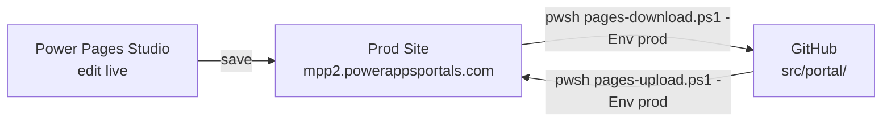
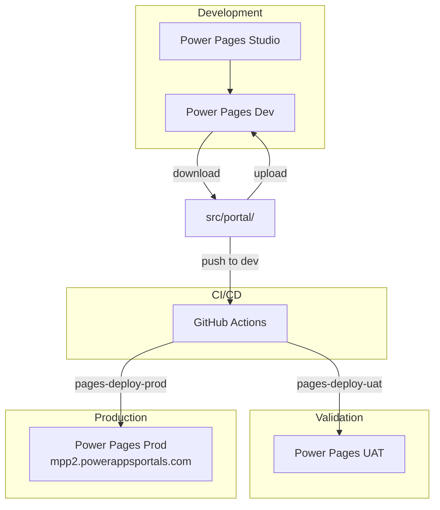

# Environment Strategy
## MaxPowerPlatformWebsite — `www.maxpowerplatform.com`

**Version**: 1.0  
**Date**: 2026-08-02  
**Status**: As-Is — **Working directly in live Prod** (no Dev/UAT separation in active use)

---

## 1. Environments

> ⚠️ **Current operating model**: All work is done directly in the live production Power Pages site at `https://mpp2.powerappsportals.com/`. The Dev and UAT environments exist in the PAC profile configuration and CI/CD workflows but are not actively used for the current phase of work.

| Environment | URL | PAC Profile | Purpose | Status |
|---|---|---|---|---|
| **Prod** | `https://mpp2.powerappsportals.com/` | `mpp-website-prod` | Live public site | **Active** |
| UAT | *(TBD)* | `mpp-website-uat` | Pre-production validation | Standby |
| Dev | *(TBD)* | `mpp-website-dev` | Development / Studio editing | Standby |

### Prod Details

| Property | Value |
|---|---|
| **Power Pages URL** | `https://mpp2.powerappsportals.com/` |
| **Custom Domain** | `www.maxpowerplatform.com` |
| **Dataverse Environment** | `mpp2.crm.dynamics.com` |
| **Website ID** | `379c4182-4ae2-46d0-9112-324244319bd6` |
| **Tenant** | `mpp` (Max Power Platform) |
| **Auth** | Azure AD B2C (`mppportalusers.b2clogin.com`) |

---

## 2. Current Workflow (Live Prod)

Since all work targets Prod directly:



### Editing Safely in Prod

1. **Before Studio session**: `pwsh ./scripts/pages-download.ps1 -Env prod` to sync local → repo
2. **Make changes in Power Pages Studio** (WYSIWYG, live)
3. **After session**: `pwsh ./scripts/pages-download.ps1 -Env prod` → `git add .` → `git commit` → `git push`
4. **If editing locally**: Edit `src/portal/` files → `pwsh ./scripts/pages-upload.ps1 -Env prod` → verify in browser

### Safety Rules for Live Prod Work

- ⚠️ **No `-ConfirmProd` bypass** — always require explicit confirmation before upload
- 📸 **Screenshot before and after** any structural change (navigation, templates, site settings)
- 📋 **Commit every session** — never let local and live drift more than one session
- 🔙 **Keep a known-good tag** — tag the last verified state before major changes

---

## 3. PAC Authentication

### Profiles

| Profile Name | Environment | Auth Method |
|---|---|---|
| `mpp-website-dev` | Dev | `--azureCliAuth` |
| `mpp-website-uat` | UAT | `--azureCliAuth` |
| `mpp-website-prod` | Prod (`mpp2`) | `--azureCliAuth` |

### Bootstrap (one-time)

```pwsh
# 1. Azure login
az login --tenant <MPP_TENANT_ID>

# 2. Create SP + federated creds (idempotent)
pwsh ./scripts/bootstrap-azure-identity.ps1

# 3. Create pac profiles
pac auth create --name mpp-website-dev  --environment <DEV_URL>  --azureCliAuth
pac auth create --name mpp-website-uat  --environment <UAT_URL>  --azureCliAuth
pac auth create --name mpp-website-prod --environment <PROD_URL> --azureCliAuth

# 4. Discover website IDs
pwsh ./scripts/list-sites.ps1
# → Record in scripts/.site-ids.json
```

### CI/CD Auth

- **Azure AD App**: `mpp-pages-website`
- **Method**: OIDC (federated credentials per GitHub Environment)
- **No client secrets** — fully passwordless

---

## 4. Future: Multi-Environment Model

When Dev and UAT environments are activated:



### Environment Promotion Flow

| Step | From | To | Trigger |
|---|---|---|---|
| 1. Studio edit | Studio | Dev | Auto (save) |
| 2. Download | Dev | Repo (`dev` branch) | Manual (`pages-download.ps1`) |
| 3. UAT deploy | `dev` branch | UAT | Auto (push to dev → CI) |
| 4. Prod deploy | `dev` branch | Prod | Manual (`workflow_dispatch` + PROD confirm) |

---

## 5. Environment Variables (GitHub)

Required for CI/CD:

| Variable | Description |
|---|---|
| `MPP_TENANT_ID` | Azure tenant ID for `mpp` |
| `MPP_PAGES_APP_ID` | Azure AD app `mpp-pages-website` client ID |
| `MPP_DEV_ENV_URL` | Dev environment URL |
| `MPP_UAT_ENV_URL` | UAT environment URL |
| `MPP_PROD_ENV_URL` | Prod environment URL (`mpp2.crm.dynamics.com`) |

### GitHub Environments

| Environment | Protection Rule |
|---|---|
| `uat` | *(TBD — suggested: require dev branch, no approvers)* |
| `prod` | Required reviewer + typed `PROD` confirmation |

---

## 6. Website IDs (`.site-ids.json`)

```json
{
  "dev":  "REPLACE-WITH-DEV-WEBSITE-ID",
  "uat":  "REPLACE-WITH-UAT-WEBSITE-ID",
  "prod": "379c4182-4ae2-46d0-9112-324244319bd6"
}
```

To discover: `pwsh ./scripts/list-sites.ps1`
