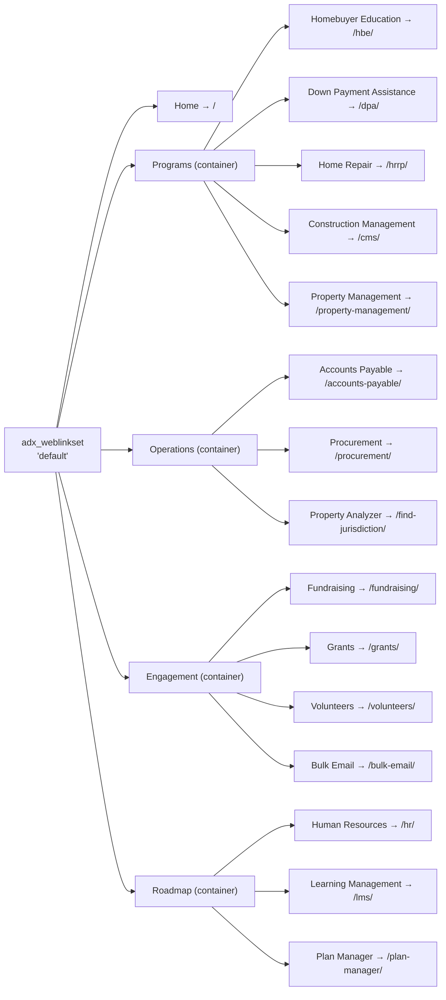
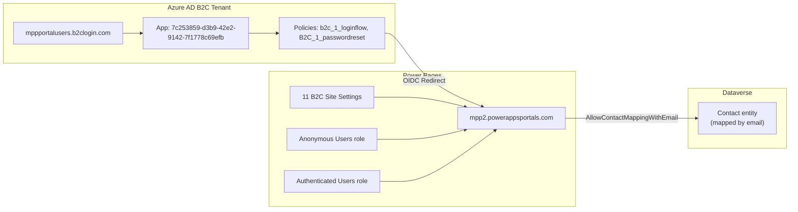
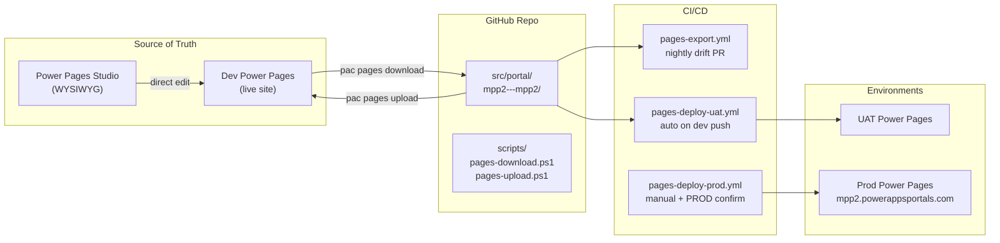

# Entity Relationship Diagram (ERD)
## MaxPowerPlatformWebsite — `www.maxpowerplatform.com`

**Version**: 1.0  
**Date**: 2026-08-02  
**Status**: As-Is Documentation

---

## 1. Core Entity Relationships

```mermaid
erDiagram
    adx_website ||--o{ adx_webpage : "contains"
    adx_website ||--o{ adx_webtemplate : "contains"
    adx_website ||--o{ adx_contentsnippet : "contains"
    adx_website ||--o{ adx_webfile : "contains"
    adx_website ||--o{ adx_weblinkset : "contains"
    adx_website ||--o{ adx_sitesetting : "configured by"
    adx_website ||--o{ adx_sitemarker : "has"
    adx_website ||--o{ adx_webrole : "has"
    adx_website ||--o{ adx_websiteaccess : "has"
    adx_website ||--o{ adx_webpageaccesscontrolrule : "has"
    adx_website ||--o{ adx_publishingstate : "has"
    adx_website ||--o{ adx_websitelanguage : "has"
    adx_website ||--o{ adx_botconsumer : "has"
    adx_website ||--o{ adx_pagetemplate : "has"

    adx_webpage }o--|| adx_pagetemplate : "uses"
    adx_webpage }o--|| adx_webpage : "parent of"
    adx_webpage }o--|| adx_publishingstate : "in state"
    adx_webpage }o--|| adx_websitelanguage : "localized to"

    adx_pagetemplate }o--|| adx_webtemplate : "renders via"

    adx_weblinkset ||--o{ adx_weblink : "contains"
    adx_weblink }o--|| adx_webpage : "points to"

    adx_websiteaccess }o--|| adx_webrole : "assigned to"

    adx_webpageaccesscontrolrule }o--|| adx_webpage : "scoped to"
    adx_webpageaccesscontrolrule }o--|| adx_webrole : "assigned to"

    adx_sitemarker }o--|| adx_webpage : "points to"

    adx_webtemplate ||--o{ adx_contentsnippet : "references"
    adx_webtemplate ||--o{ adx_webfile : "references"

    adx_website {
        guid adx_websiteid PK "379c4182-..."
        string adx_name "MPP2 - MPP2"
        guid adx_headerwebtemplateid FK
        guid adx_footerwebtemplateid FK
        guid adx_defaultlanguage FK
        guid adx_defaultbotconsumerid FK
    }

    adx_webpage {
        guid adx_webpageid PK
        string adx_name "e.g., Home, Hbe"
        string adx_title "e.g., Homebuyer Education"
        string adx_partialurl "e.g., hbe"
        guid adx_parentpageid FK
        guid adx_pagetemplateid FK
        guid adx_publishingstateid FK
        int adx_displayorder
        bool adx_hiddenfromsitemap
        bool adx_excludefromsearch
        string adx_copy "HTML content"
    }

    adx_pagetemplate {
        guid adx_pagetemplateid PK
        string adx_name "Default studio template"
        int adx_type "WebTemplate or RewriteUrl"
        string adx_rewriteurl "~ /Pages/Search.aspx"
        guid adx_webtemplateid FK "if type=WebTemplate"
    }

    adx_webtemplate {
        guid adx_webtemplateid PK
        string adx_name "e.g., Header, Footer"
        string adx_source "Liquid/HTML code"
        string adx_mimetype "text/html"
    }

    adx_contentsnippet {
        guid adx_contentsnippetid PK
        string adx_name "Footer"
        string adx_display_name "Footer"
        int adx_type "Text or HTML"
        string adx_value "Content value"
    }

    adx_weblinkset {
        guid adx_weblinksetid PK
        string adx_name "default"
    }

    adx_weblink {
        guid adx_weblinkid PK
        string adx_name "Homebuyer Education"
        guid adx_weblinksetid FK
        guid adx_parentweblinkid FK "for nested links"
        guid adx_pageid FK "target page"
    }

    adx_webfile {
        guid adx_webfileid PK
        string adx_name "mpp-logo.png"
        string adx_partialurl "mpp-logo.png"
        guid adx_publishingstateid FK
    }

    adx_sitesetting {
        guid adx_sitesettingid PK
        string adx_name "Search/Enabled"
        string adx_value "True"
    }

    adx_sitemarker {
        guid adx_sitemarkerid PK
        string adx_name "Home"
        guid adx_pageid FK
    }

    adx_webrole {
        guid adx_webroleid PK
        string adx_name "Anonymous Users"
        bool adx_anonymoususersrole
        bool adx_authenticatedusersrole
    }

    adx_websiteaccess {
        guid adx_websiteaccessid PK
        guid adx_webroleid FK
        bool adx_previewunpublished
        bool adx_managesnippets
        bool adx_managesitemarkers
        bool adx_manageweblinksets
    }

    adx_webpageaccesscontrolrule {
        guid adx_webpageaccesscontrolruleid PK
        guid adx_webpageid FK
        guid adx_webroleid FK
        int adx_right "1=Grant Change"
        int adx_scope "1=All Content"
    }

    adx_publishingstate {
        guid adx_publishingstateid PK
        string adx_name "Published"
        bool adx_isdefault
        bool adx_isvisible
    }

    adx_websitelanguage {
        guid adx_websitelanguageid PK
        string adx_name "English"
        int adx_lcid 1033
    }

    adx_botconsumer {
        guid adx_botconsumerid PK
        string adx_name "Bot Consumer"
        string adx_botschemaname
    }
```

---

## 2. Page Hierarchy (Self-Referencing)

```mermaid
graph TD
    HOME["adx_webpage<br/>Home<br/>id: e600cd70<br/>parent: NULL"]
    PAGE["adx_webpage<br/>Page<br/>id: b4b09772<br/>parent: e600cd70"]
    SP1["adx_webpage<br/>Subpage one<br/>parent: b4b09772"]
    SP2["adx_webpage<br/>Subpage two<br/>parent: b4b09772"]
    OPT["adx_webpage<br/>OptIn<br/>parent: e600cd70"]
    PRIV["adx_webpage<br/>Privacy<br/>parent: e600cd70"]
    AD["adx_webpage<br/>Access Denied<br/>parent: e600cd70"]
    PNF["adx_webpage<br/>Page Not Found<br/>parent: e600cd70"]
    SRCH["adx_webpage<br/>Search<br/>parent: e600cd70"]
    PROF["adx_webpage<br/>Profile<br/>parent: e600cd70"]

    HOME --> PAGE
    HOME --> OPT
    HOME --> PRIV
    HOME --> AD
    HOME --> PNF
    HOME --> SRCH
    HOME --> PROF

    PAGE --> SP1
    PAGE --> SP2

    subgraph "15 Module Pages (parent: e600cd70)"
        HBE["Hbe"]
        DPA["Dpa"]
        HRRP["Hrrp"]
        CMS["Cms"]
        PM["PropertyManagement"]
        AP["AccountsPayable"]
        PROC["Procurement"]
        PA["FindJurisdiction"]
        FUND["Fundraising"]
        GRANTS["Grants"]
        VOL["Volunteers"]
        BE["Bulk-email"]
        HR["Hr"]
        LMS["Lms"]
        PLAN["PlanManager"]
    end

    HOME --> HBE
    HOME --> DPA
    HOME --> HRRP
    HOME --> CMS
    HOME --> PM
    HOME --> AP
    HOME --> PROC
    HOME --> PA
    HOME --> FUND
    HOME --> GRANTS
    HOME --> VOL
    HOME --> BE
    HOME --> HR
    HOME --> LMS
    HOME --> PLAN
```



---

## 3. Navigation Link Tree



---

## 4. Authentication Flow Data



---

## 5. Deployment Pipeline Data Flow


