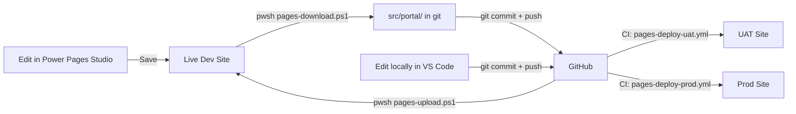

# Functional Design Document (FDD)
## MaxPowerPlatformWebsite — `www.maxpowerplatform.com`

**Version**: 1.0  
**Date**: 2026-08-02  
**Status**: As-Is Documentation

---

## 1. Site Structure

### 1.1 Page Hierarchy

```mermaid
graph TB
    ROOT["🏠 Home<br/>adx_name: Home<br/>partial_url: /"]
    PAGE["Page<br/>(parent container)"]
    SP1["Subpage one"]
    SP2["Subpage two"]
    OPT["OptIn<br/>(hidden)"]
    PRIV["Privacy<br/>(hidden)"]
    AD["Access Denied<br/>(hidden)"]
    PNF["Page Not Found<br/>(hidden)"]
    SRCH["Search<br/>(hidden)"]
    PROF["Profile<br/>(hidden)"]

    ROOT --> PAGE
    ROOT --> OPT
    ROOT --> PRIV
    ROOT --> AD
    ROOT --> PNF
    ROOT --> SRCH
    ROOT --> PROF

    PAGE --> SP1
    PAGE --> SP2

    subgraph "15 Module Pages (hidden from sitemap)"
        HBE["Homebuyer Education<br/>hbe"]
        DPA["Down Payment Assistance<br/>dpa"]
        HRRP["Home Repair<br/>hrrp"]
        CMS["Construction Mgmt<br/>cms"]
        PM["Property Mgmt<br/>property-management"]
        AP["Accounts Payable<br/>accounts-payable"]
        PROC["Procurement<br/>procurement"]
        PA["Property Analyzer<br/>find-jurisdiction"]
        FUND["Fundraising<br/>fundraising"]
        GRANTS["Grant Management<br/>grants"]
        VOL["Volunteers<br/>volunteers"]
        BE["Bulk Email<br/>bulk-email"]
        HR["Human Resources<br/>hr"]
        LMS["Learning Mgmt<br/>lms"]
        PLAN["Plan Manager<br/>plan-manager"]
    end

    ROOT --> HBE
    ROOT --> DPA
    ROOT --> HRRP
    ROOT --> CMS
    ROOT --> PM
    ROOT --> AP
    ROOT --> PROC
    ROOT --> PA
    ROOT --> FUND
    ROOT --> GRANTS
    ROOT --> VOL
    ROOT --> BE
    ROOT --> HR
    ROOT --> LMS
    ROOT --> PLAN
```



### 1.2 Navigation Menu (Web Link Set: `default`)

| Level 1 | Level 2 | Target Page |
|---|---|---|
| **Home** | — | Home (`/`) |
| **Programs** | Homebuyer Education | `/hbe/` |
| | Down Payment Assistance | `/dpa/` |
| | Home Repair | `/hrrp/` |
| | Construction Management | `/cms/` |
| | Property Management | `/property-management/` |
| **Operations** | Accounts Payable | `/accounts-payable/` |
| | Procurement | `/procurement/` |
| | Property Analyzer | `/find-jurisdiction/` |
| **Engagement** | Fundraising | `/fundraising/` |
| | Grants | `/grants/` |
| | Volunteers | `/volunteers/` |
| | Bulk Email | `/bulk-email/` |
| **Roadmap** | Human Resources | `/hr/` |
| | Learning Management | `/lms/` |
| | Plan Manager | `/plan-manager/` |

### 1.3 Profile Navigation (Web Link Set: `profile-navigation`)

| Link | Target Page |
|---|---|
| Profile | `/profile/` |

---

## 2. User Flows

### 2.1 Anonymous Visitor — Browse Modules

```
Visitor lands on /
  → Sees hero + 3 tile sections
  → Clicks a tile (e.g., "Homebuyer Education")
  → Navigates to /hbe/
  → Reads module detail
  → Returns via nav or breadcrumb
```

### 2.2 Anonymous Visitor — Contact

```
Visitor lands on /
  → Scrolls to bottom
  → Sees "Get in touch" CTA
  → Clicks mailto:max@maxpowerplatform.com
  → Email client opens
```

### 2.3 Sign Up / Sign In

```
Visitor clicks "Sign in" in header
  → Redirected to Azure AD B2C (mppportalusers.b2clogin.com)
  → Enters email
  → If new: sign-up flow (email verification)
  → If returning: password
  → Redirected back to portal
  → Now sees "Profile" instead of "Sign in"
```

### 2.4 Search

```
Visitor types query in search form
  → GET /search?q=...
  → Search Results template executes 
  → Results displayed with pagination
  → If no results: Search/NoResults snippet
```

---

## 3. Page Details

### 3.1 Home (`/`)
- **Template**: Default studio template
- **Content**: Hardcoded HTML with 5 tile sections
- **Editable**: Via Power Pages Studio (`adx_copy`)

### 3.2 Module Pages (15 pages)
Each follows the same pattern:
- **Template**: Default studio template
- **Content**: Module-specific HTML (editable via Studio)
- **Files per page**:
  - `*.webpage.copy.html` — editable content
  - `*.webpage.custom_css.css` — page-specific CSS
  - `*.webpage.custom_javascript.js` — page-specific JS
  - `*.webpage.summary.html` — meta description
  - `*.webpage.yml` — metadata (title, parent, partial URL)
  - `content-pages/` — localized content variants

### 3.3 Privacy (`/privacy/`)
- **Content**: Privacy policy with contact info (`admin@maxpowerplatform.com`)
- **Hidden from sitemap**: Yes

### 3.4 OptIn (`/optin/`)
- **Content**: SMS marketing opt-in with T&C link to `/privacy/`
- **Hidden from sitemap**: Yes

### 3.5 Profile (`/profile/`)
- **Template**: Profile (rewrite to `~/Pages/Profile.aspx`)
- **Access**: Authenticated users only
- **Hidden from sitemap**: Yes

### 3.6 Search (`/search/`)
- **Template**: Search (rewrite to `~/Pages/Search.aspx`)
- **Web Template**: Search Results
- **Hidden from sitemap**: Yes

### 3.7 Access Denied (`/access-denied/`)
- **Template**: Access Denied (rewrite)
- **Excluded from search**: Yes

### 3.8 Page Not Found (`/page-not-found/`)
- **Template**: Default studio template
- **Excluded from search**: Yes

### 3.9 Page (`/page/`) + Subpages
- **Template**: Default studio template
- **Children**: Subpage one, Subpage two
- **Purpose**: Shared page configuration container (stub/generic)

---

## 4. Content Management Workflow



### Rules
1. **Pick one editor per session**: Studio OR local — not both
2. **Studio wins on conflict**: It's the live source
3. **Download before Studio session**: Avoid overwriting local changes
4. **Prod requires confirmation**: Typed `PROD` + GitHub Environment review

---

## 5. Roles & Permissions

| Role | Anonymous | Authenticated | Admin |
|---|---|---|---|
| Browse public pages | ✅ | ✅ | ✅ |
| View profile | ❌ | ✅ | ✅ |
| Access admin pages | ❌ | ❌ | ✅ |
| Manage snippets | ❌ | ❌ | ✅ |
| Manage site markers | ❌ | ❌ | ✅ |
| Manage web link sets | ❌ | ❌ | ✅ |
| Preview unpublished | ❌ | ❌ | ✅ |
| Grant Change (content edit) | ❌ | ❌ | ✅ |

### Web Page Access Rules

| Rule | Right | Scope | Role |
|---|---|---|---|
| Grant Change to Content | Grant Change | All Content | *(none — open)* |
| Grant Change to Administrators | Grant Change | Home (root) | Administrators |

> Note: The first rule (`Grant Change to Content`) has **no role assigned**, meaning it's not enforced. The second rule grants admin access scoped to the Home root. In practice, content editing is done through Power Pages Studio, not front-end inline editing.

---

## 6. Form Handling

### Lead Capture Form
- Script: `Setup-LeadForm.ps1`
- Fallback: `mailto:max@maxpowerplatform.com`
- Error handling: Displays inline status message on submission failure

### Profile Form
- Built-in Power Pages profile page (`~/Pages/Profile.aspx`)
- Allows authenticated users to update contact information

---

## 7. Chatbot Integration

- **Bot Schema Name**: `cr27b_99c91920-3594-4112-8c81-e7418fcf338d`
- **Bot Consumer ID**: `02ede270-57f3-ee11-904c-6045bdd736b6`
- **Embed Method**: `PvaEmbeddedWebChat.renderWebChat()` in `power-virtual-agents` web template
- **Configuration Source**: `adx_botconsumer` Dataverse entity
