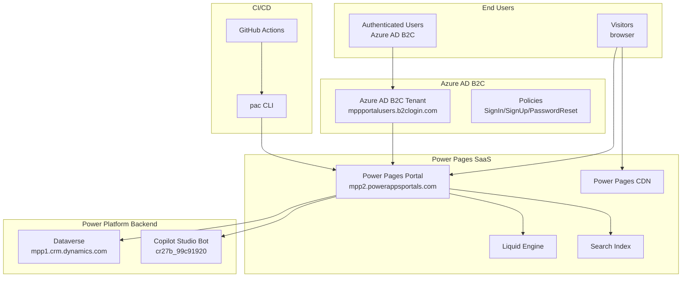
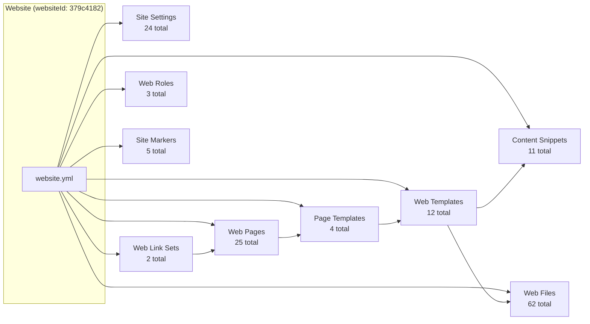
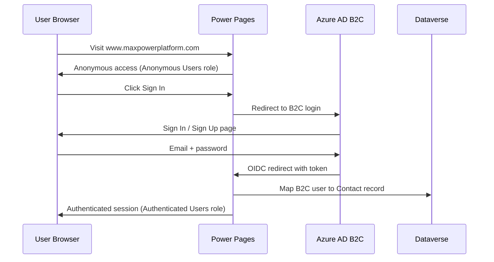
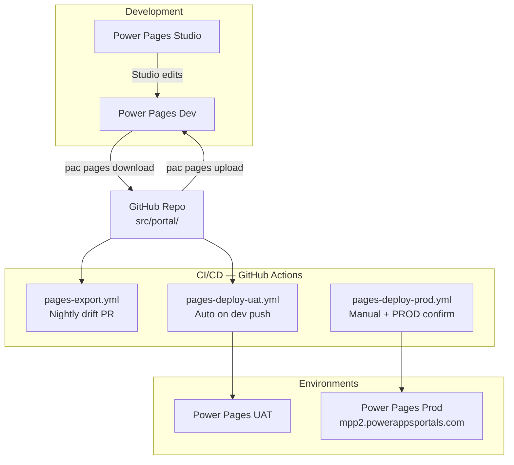

# Solution Architecture (SA)
## MaxPowerPlatformWebsite — `www.maxpowerplatform.com`

**Version**: 1.0  
**Date**: 2026-08-02  
**Status**: As-Is Documentation

---

## 1. Architecture Overview

---

## 2. Technology Stack

| Layer | Technology | Version/Purpose |
|---|---|---|
| **Portal Platform** | Microsoft Power Pages | SaaS, modelVersion 2 |
| **Frontend Framework** | Bootstrap 5 | `bootstrap.min.css`, `Site/BootstrapV5Enabled: true` |
| **Template Engine** | Liquid (Power Pages) | 12 custom web templates |
| **Authentication** | Azure AD B2C (OIDC) | `mppportalusers.b2clogin.com`, policy `b2c_1_loginflow` |
| **Backend Data** | Microsoft Dataverse | `mpp1.crm.dynamics.com` |
| **Chatbot** | Copilot Studio (PVA) | `PvaEmbeddedWebChat.renderWebChat()` |
| **CI/CD** | GitHub Actions | 3 workflows: export, deploy-uat, deploy-prod |
| **CLI** | Power Platform CLI (`pac`) | `--azureCliAuth`, `pages download/upload` |
| **Auth (CI)** | Azure Service Principal + OIDC | `mpp-pages-website` app registration |

---

## 3. Portal Component Architecture

### Key Relationships

1. **Website** → **Header/Footer** web templates (configured in `website.yml`)
2. **Page Template** `Default studio template` (web template type) → **Default studio template** web template → renders `adx_copy`
3. **Web Pages** → each assigned a **Page Template** and a **Parent Page**
4. **Web Link Sets** → link to **Web Pages**, forming the navigation menu
5. **Content Snippets** → referenced by **Web Templates** (e.g., Footer, Header, Mobile Header)
6. **Site Markers** → point to specific **Web Pages** (Home, Search, Profile, Access Denied, Page Not Found)
7. **Web Roles** → assigned to **Website Access Permissions** and **Web Page Access Rules**

---

## 4. Authentication Flow

### B2C Configuration
- **Tenant**: `mppportalusers.b2clogin.com`
- **Client ID**: `7c253859-d3b9-42e2-9142-7f1778c69efb`
- **Policy**: `b2c_1_loginflow` (SignIn/SignUp), `B2C_1_passwordreset`
- **Redirect URI**: `https://mpp2.powerappsportals.com/signin-aad-b2c_1`
- **Contact Mapping**: `AllowContactMappingWithEmail: true`
- **Local Login**: Disabled (`LocalLoginEnabled: false`)

---

## 5. Deployment Architecture

### CI/CD Pipelines

| Pipeline | Trigger | Action |
|---|---|---|
| `pages-export.yml` | Nightly schedule | Downloads live Dev → creates drift PR |
| `pages-deploy-uat.yml` | Push to `dev` | Uploads `src/portal/` to UAT |
| `pages-deploy-prod.yml` | Manual (`workflow_dispatch`) | Requires typed `PROD` + GH environment review → uploads to Prod |

### PAC Profiles

| Profile | Environment | Auth |
|---|---|---|
| `mpp-website-dev` | Dev | `--azureCliAuth` |
| `mpp-website-uat` | UAT | `--azureCliAuth` |
| `mpp-website-prod` | Prod (`mpp2`) | `--azureCliAuth` |

---

## 6. Security Model

| Aspect | Configuration |
|---|---|
| **Authentication** | Azure AD B2C OIDC, email-based |
| **Anonymous access** | All public pages (Anonymous Users role) |
| **Authenticated pages** | Profile page |
| **Admin access** | Administrators role (full permissions) |
| **Frame protection** | `X-Frame-Options: SAMEORIGIN` |
| **Secrets** | No client secrets in repo — Azure SP + OIDC for CI |
| **Prod deploy gate** | GitHub Environment review + typed `PROD` confirmation |

---

## 7. Integration Points

| Integration | Details |
|---|---|
| **Dataverse** | Backend for Contacts, bot consumer, search index |
| **Copilot Studio** | Embedded chatbot via `PvaEmbeddedWebChat` |
| **Azure AD B2C** | User authentication and profile mapping |
| **Azure (CI)** | Service Principal `mpp-pages-website` + federated OIDC credentials |

---

## 8. Technical Constraints

| Constraint | Detail |
|---|---|
| **Power Pages limits** | SaaS-imposed: page count, bandwidth, storage |
| **Single language** | English only (no multi-language configured) |
| **Managed environments** | UAT and Prod are managed-only |
| **No custom code** | All customization via Liquid templates + Bootstrap CSS — no server-side plugins |
| **pac modelVersion 2** | Export format is v2 (`--modelVersion 2`) |
| **Studio vs Code editing** | Must pick one per session to avoid drift |
